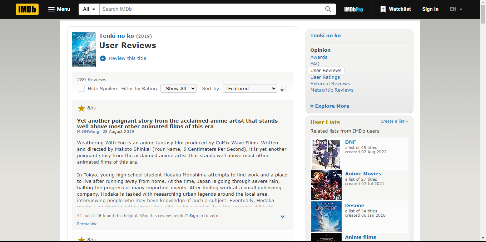
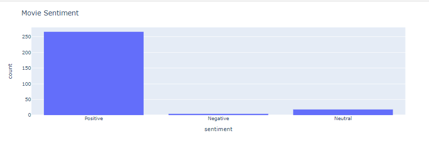
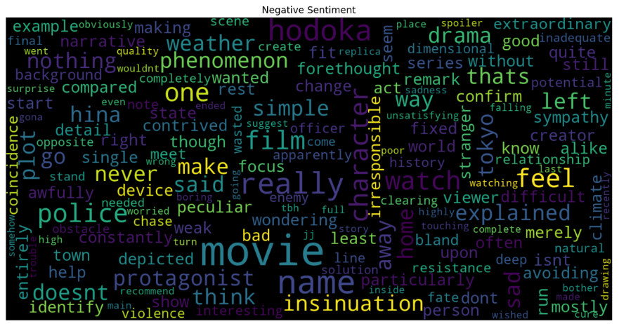
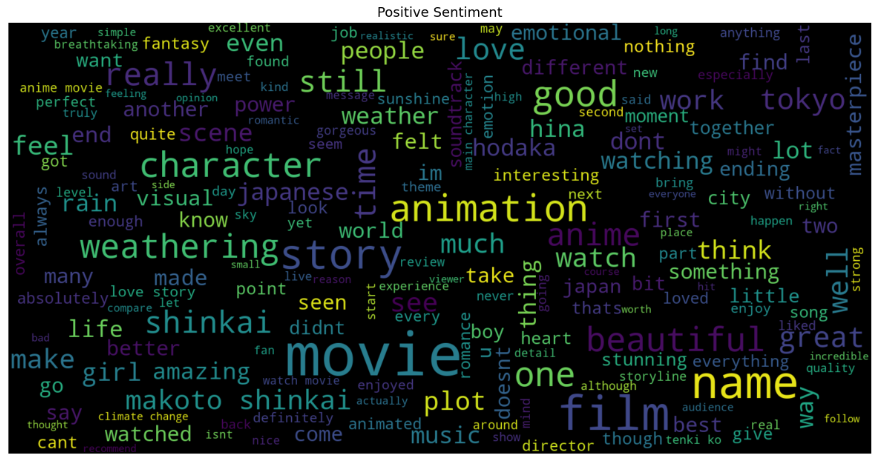

# Sentiment Analysis of Movies on IMDB using Web Scraping and Vader Analysis
This script is used to analyze sentiment towards a movie based on its reviews. \
The script using web scrapping to retrieve review data automatically from the IMDB website, and using Vader to analyze the sentiment.

The final result of this script is to summarize sentiment of the movie.

 

